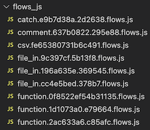

# node-red-contrib-js-storage

Node-RED storage plugin to store flows as `.js` files for easy readability, code reviews, and scans.

## Overview

Node-RED stores flows in a JSON file with dynamic order and stringified code. Inspired by `node-red-contrib-yaml-storage` plugin, the js-storage plugin takes readability further and splits flows JSON file into individual JavaScript files - valid CommonJS modules that are easy to read, scan, and commit.



## Advantages

- JavaScript files have static names (from node type and ID). Re-arranging nodes will not mess up your diffs anymore!
- Function code can be scanned by Sonarqube or other static code analysis tools.
- Function code is editable outside Node-RED (use this feature at own risk).
- `flows.json` (and it's backup file) is still kept updated by default (see configuration). This means you can use them as a backup, for backward compatibility, or for code sharing.

## Configuration

The plugin reads the following configuration from `settings.js`:

- `storageModule`
  - Required. Must be set to `require('node-red-contrib-js-storage')`
- `flowDir`
  - Optional. Set to your own directory name for flows.
- `flowFileReadOnly`
  - Optional. Set to `true` if you want to stop using (or completely remove) flows.json and it's backup file.

Example:

```
 storageModule: require('node-red-contrib-js-storage')

 // node-red-contrib-js-storage: The dir containing the flows. If not set, it defaults to <flowFile without extension>_js
 flowDir: "flows_js",

 // node-red-contrib-js-storage: Prevent updates to flow file. If not set, flow file will be kept updated along JS files in flowDir
 flowFileReadOnly: true,

```

## Installation

Locally:

```bash
npm install node-red-contrib-js-storage
```

Globally:

```bash
sudo npm install -g node-red-contrib-js-storage
```

You will also need to modify your `settings.js` file and add the following:

```javascript
storageModule: require("node-red-contrib-js-storage");
```

## Usage

On initial load the plugin reads your current flows file in either JSON or YAML format (if you used `node-red-contrib-yaml-storage`) and converts them on save. **Support for initial YAML conversion will be removed in future versions**

JavaScript files for deleted nodes (with extension `.flows.js`) are deleted on Deploy. If you need to restore the previous state from flows json backup file, delete the whole directory.

## Example

<!-- prettier-ignore-start -->
Original function node code from flows.json:

```json
[
  {
    "id": "fded463a16684b06",
    "type": "function",
    "z": "66d84716f9f936a2",
    "name": "My function",
    "func": "console.log('On message')",
    "outputs": 2,
    "noerr": 0,
    "initialize": "// Code added here will be run once\n// whenever the node is started.\nconsole.log('I am here')",
    "finalize": "// Code added here will be run when the\n// node is being stopped or re-deployed.\nconsole.log('I am gone')",
    "libs": [],
    "x": 540,
    "y": 320,
    "wires": [[], []],
    "info": "# Templates and info\n...are transformed into template literals"
  }
]
```

Transformed file `function.fded463a16684b06.flows.js` in `flows_js` directory:

```js
const Node = {
  "id": "fded463a16684b06",
  "type": "function",
  "z": "66d84716f9f936a2",
  "name": "My function",
  "func": "",
  "outputs": 1,
  "noerr": 0,
  "initialize": "",
  "finalize": "",
  "libs": [],
  "x": 410,
  "y": 360,
  "wires": [
    []
  ],
  "info": ""
};

Node.info = `
# Templates and info
...are transformed into template literals
`;

Node.initialize = async function (node, msg, RED, context, flow, global, env, util) {
  // Code added here will be run once
  // whenever the node is started.
  console.log("I am here");
};

Node.func = async function (node, msg, RED, context, flow, global, env, util) {
  console.log("On message");
};

Node.finalize = async function (node, msg, RED, context, flow, global, env, util) {
  // Code added here will be run when the
  // node is being stopped or re-deployed.
  console.log("I am gone");
};

module.exports = Node;
```
<!-- prettier-ignore-end -->
